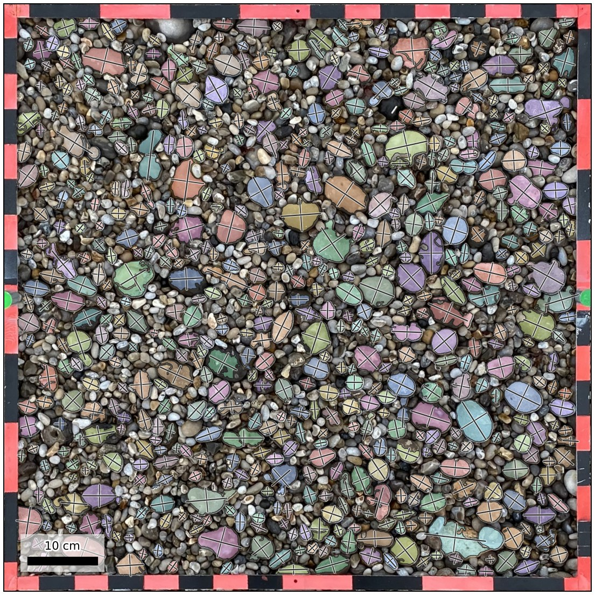
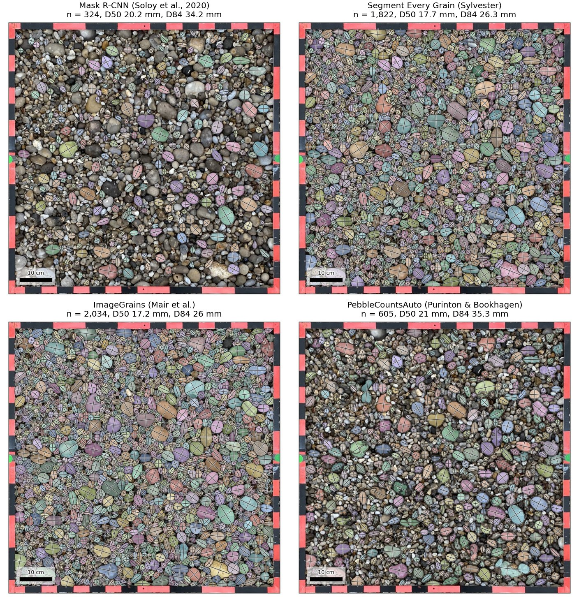

# PebbleCountsAuto as a PebbleMapper detection model

This plug-in lets [PebbleMapper](https://github.com/soloyant/pebblemapper) detect clasts
with [PebbleCountsAuto](https://github.com/UP-RS-ESP/PebbleCounts) (Purinton &
Bookhagen, 2019). PebbleCountsAuto is not a neural network. It uses k-means colour
masking, edge detection and ellipse filtering in OpenCV and scikit-image, runs on the
CPU and needs no trained model. The adapter runs it in its own conda environment,
takes the grain mask it builds and hands the grains to PebbleMapper as a label image.
PebbleMapper then measures every clast with its own measurement step, so sizes are
defined exactly as for its built-in Mask R-CNN model. Nothing in PebbleMapper is
modified.

## Requirements

- A working PebbleMapper installation.
- Conda (Miniconda or Anaconda).
- Git, to clone PebbleCounts.
- No GPU is needed.

## Installation

1. Clone PebbleCounts into `upstream/`:

   ```bat
   python scripts/get_upstream.py
   ```

   PebbleCounts is not part of this repository; the script clones it from its authors'
   repository into `upstream/`, which is git-ignored.

2. Create the conda environment from this folder:

   ```bat
   conda env create -f environment.yml
   ```

   This creates `pm-pebblecounts`. If conda cannot solve GDAL on your machine, set
   `PM_PC_ENV=maskrcnn` before starting PebbleMapper. PebbleCountsAuto's dependencies
   are a subset of PebbleMapper's own environment.

3. Declare the backend in PebbleMapper's `user_detectors.json`. Copy
   `user_detectors.example.json` and set `path` to the folder of this repository:

   ```json
   [
    {"module": "pm_pebblecounts_backend.backend", "factory": "make_backend",
     "path": "C:/path/to/pebblemapper-backend-pebblecounts"}
   ]
   ```

4. Restart PebbleMapper.

There are no weights to download.

## How the adapter works

`PebbleCountsAuto.py` is written to be run by hand. It takes its options on the command
line but still asks one question interactively, writes a colour picture rather than a
label image, and its CSV carries no coordinates for a plain photograph. `run.py`
therefore executes the unmodified script inside its own process (`runpy`), answers the
question, and takes the grain mask the script builds internally (`label_fixed`). The
instances are then handed to PebbleMapper as a label image. Nothing upstream is patched.

## Usage in PebbleMapper

After the restart, **PebbleCountsAuto (Purinton & Bookhagen)** appears in the **Detection
model** selector in the left panel, next to Mask R-CNN. Select it and run detection as
usual. The result is the same per-clast table as with Mask R-CNN.

Points to note:

- **Ellipse-fit filters.** The algorithm keeps only the grains that pass its ellipse-fit
  filters.
- **Framed quadrat photographs.** The algorithm has no notion of a quadrat frame and
  measures pieces of the frame as grains. A photograph rectified by PebbleMapper's
  Orthorectify carries the frame's thickness in its sidecar, and the frame band is left
  out automatically. For any other framed photograph, draw an *ROI per image* (Detect
  tab).
- **No confidence score.** Every clast is scored 1.0.
- **Algorithm options.** PebbleCountsAuto's own parameters (`otsu_threshold`, `cutoff`,
  `percent_overlap`, `misfit_threshold`, `min_size_threshold`, `first_nl_denoise`,
  `tophat_th`, `sobel_th`, `canny_sig`) are passed through the `PM_PC_OPTIONS`
  environment variable as JSON. The defaults are the script's own.

PebbleMapper writes the model's name, version and licence into every run's
`.manifest.json`.

## Licences

| Component | Copyright | Licence |
|---|---|---|
| This adapter | © 2026 Antoine Soloy | GPL-3.0-or-later (`LICENSE`) |
| PebbleCounts (`PebbleCountsAuto.py`, `PCfunctions.py`) | © Benjamin Purinton | GPL-3.0-or-later |
| Weights | none; the algorithm uses no trained model | not applicable |

`run.py` loads the upstream script into its own process, so the adapter carries the same
GPL terms as PebbleCounts and is kept in a repository separate from PebbleMapper, which
is MIT and launches the adapter as a separate process. No PebbleCounts code is included
in this repository. The adapter is an independent project and is not affiliated with or
endorsed by the PebbleCounts authors.

## Citation

If you use this model, cite the PebbleCounts paper:

Purinton, B., & Bookhagen, B. (2019). Introducing PebbleCounts: a grain-sizing tool for
photo surveys of dynamic gravel-bed rivers. *Earth Surface Dynamics*, 7, 859–877.
https://doi.org/10.5194/esurf-7-859-2019

## The same photograph through every model

The rectified quadrat photograph of PebbleMapper's `example_03_Etretat` (IMG_0955: 0.84 m
frame, 0.567 mm/px, a densely packed flint beach, 1,362 fully visible pebbles outlined by hand)
was run through every model PebbleMapper can use, with the frame band left out and each
clast measured by PebbleMapper's own step. The ImageGrains plug-in provides two models,
ImageGrains 2.0 and 1.2.

| Model | Detections | True positives | Recall | Precision | F1 | Length RMSE | D50 | D84 | Time per photograph |
|---|---|---|---|---|---|---|---|---|---|
| Hand outlines (reference) | 1,362 | | | | | | 17.7 mm | 26.5 mm | |
| Mask R-CNN (PebbleMapper, built in) | 324 | 320 | 0.23 | 0.99 | 0.38 | 1.6 mm | 20.2 mm | 34.2 mm | 41 s (GPU) |
| Segmenteverygrain | 1,822 | 1,350 | 0.99 | 0.74 | 0.85 | 1.0 mm | 17.7 mm | 26.3 mm | 259 s (GPU) |
| ImageGrains 2.0 | 2,928 | 1,346 | 0.99 | 0.46 | 0.63 | 1.4 mm | 14.5 mm | 22.1 mm | 154 s (GPU) |
| ImageGrains 1.2 | 2,034 | 1,316 | 0.97 | 0.65 | 0.78 | 1.7 mm | 17.2 mm | 26.0 mm | 51 s (CPU) |
| PebbleCountsAuto | 605 | 491 | 0.36 | 0.81 | 0.50 | 4.1 mm | 21.0 mm | 35.3 mm | 17 s (CPU) |
| OrthoSAM | 1,659 | 1,079 | 0.79 | 0.65 | 0.71 | 1.4 mm | 17.6 mm | 26.8 mm | 430 s (GPU) |

Detections are paired with the 1,362 hand-outlined clasts by position and size, as
PebbleMapper's Validate tab does. A true positive is a detection paired with a
hand-outlined clast; recall is true positives over the 1,362 hand-outlined clasts,
precision is true positives over the detections, and F1 is their harmonic mean. False
negatives (1,362 minus true positives) and false positives (detections minus true
positives) follow from the table. Length RMSE is computed on the true positives.

The hand outlines keep only the pebbles lying fully visible on top of the sediment;
partly buried and overlapping pebbles were removed by hand. This is the rule Mask R-CNN's
training labels follow. The hand outlines were started from Segmenteverygrain's
detections. Times are for one photograph once the model is loaded (loading adds 7 to
70 s once per run), on a 2018 laptop (Intel Core i7-8850H, NVIDIA Quadro P600 with 4 GB).
ImageGrains 1.2 and PebbleCountsAuto run on the CPU.

<p align="center">
  
</p>
<p align="center"><em>PebbleCountsAuto's detections on the whole photograph, each clast filled by size class and outlined, its long and short axes drawn.</em></p>

<p align="center">
  
</p>
<p align="center"><em>A 40 cm crop of the same photograph: the hand outlines and each model's detections, both ImageGrains versions included, on the same size classes in every panel.</em></p>

<p align="center">
  
</p>
<p align="center"><em>Cumulative distributions of clast length, D50 (circle) and D84 (square) marked; the grey band is below 8 pixels, the detection limit of this photograph.</em></p>
